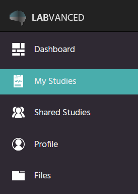

# How to publish and record a study in Labvanced

## Persona

* **Job description** - assistant professor of psychology
* **Company name** - Adam Mickiewicz University in Poznań
* **Company size** - 5000
* **Industry** - psychology, education
* **Age** - 48
* **Gender** - male
* **Income** - PLN 96 000 a year
* **Education level** - PhD
* **Experience with research software** - 2/5
* **Computer knowledge** - 2/5
* **Documentation use** - 2/5
* **Confidence** - 4/5
* **Stress Level** - 1/5

His goal is to use Labvanced to record an online study on psychology with human participants. He has used other online research software, but his computer knowledge is quite limited. He is eager to learn, confident in his abilities, and not stressed (he is a psychologist, so he knows how to deal with that).

He will use a user manual, which will be available on the university's website and targeted at the university's employees who need to know how to use Labvanced but do not have much experience/knowledge with similar software. Particular steps will be covered in separate sections.

The following is a section on how to publish and record a study in Labvanced.

## Table of contents
  - [Introduction](#introduction)
  - [Step-by-step guide](#step-by-step-guide)
  - [Glossary](#glossary)
  - [Useful links](#useful-links)

## Introduction

Labvanced is a platform on which you can create online experiments.

In this guide, you will learn how to publish and record a study you have created.

## Step-by-step guide

Go to the Labvanced homepage. On the menu on the left-hand side, click *My Studies*.

You should see the list of your studies. Double-click on the study you want to publish and record. Next, click *Publish & Record* on the left-hand side menu.

Now you should see the requirements to publish and record a study. By default, the study design is valid, and you are its owner. To fulfil the requirements, first, click on the icon next to *Description: No keyword(s), No affiliation*.

In this section, you need to do two things:
1. Add at least one keyword. To do it, click on the keyword that you want to add in the drop-down menu in the *Keywords* section.
2. In the *Author or Affiliation* section, write your name or the name of the institution you are affiliated with.

Here you can also set the minimum and maximum duration of your study and give it a description. However, that is not obligatory.

Next, return to the *Publish & Record* section. Click on the icon next to *Variable Check: Not confirmed*.

All you need to do here is click the button to confirm variables.

Next, once again return to the *Publish & Record* section. Click on the icon next to *Data Recording: Not enabled*.

Here click the button to enable recordings. 

Next, return to the *Publish & Record* section. Click the button to review and publish your study.

You should see a publishing wizard with three sections. In the *Recruiting options* section, you can decide if you want to use a password protection for your study.

Click the *Next* button. Now you are in the *License Selection*. Here you need to select *Use my current license: Lab/Department License*. To browse other options, you can also click *Explore more license options*.

Click the *Next* button. Now you are in the *Confirm & Publish* section. Here you need to accept all three terms and conditions. Then, click the *Publish* button.

You have published your study. To invite participants to your study, you can copy and send them the link. 

## Glossary

**Variable** - any factor that can be manipulated, controlled for, or measured in an experiment

**Wizard** - a help feature of a software package that automates complex tasks by asking the user a series of easy-to-answer questions.

## Useful links

[Labvanced homepage](https://www.labvanced.com/)

[Tutorial on how to create a sample study design in Labvanced](https://www.youtube.com/watch?v=E6G3ZI9JKBQ)

